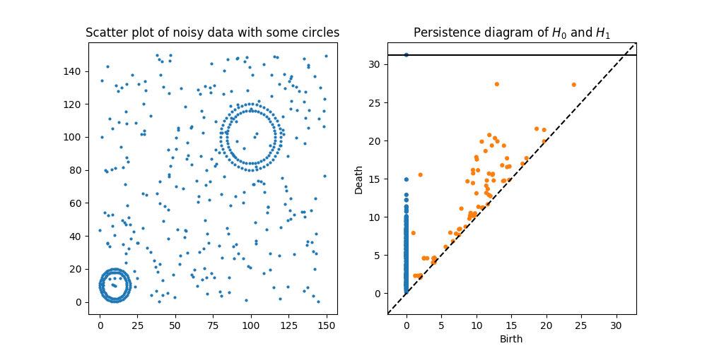
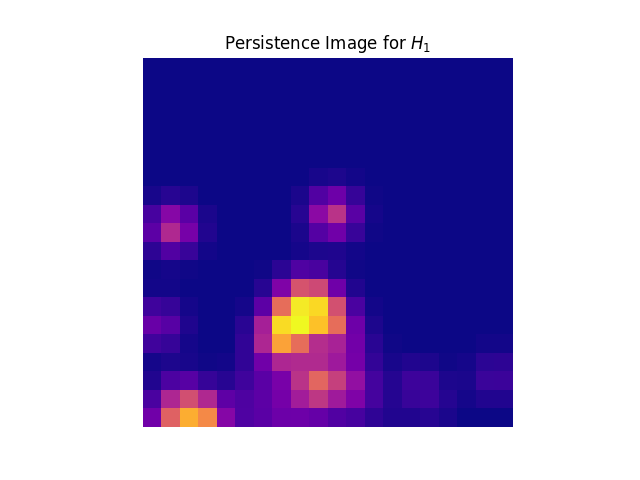

[](https://badge.fury.io/py/persim)
[](https://travis-ci.org/sauln/persim)
[](https://codecov.io/gh/sauln/persim)
[](https://opensource.org/licenses/MIT)

# Persim 

Persim is a Python implementation of Persistence Images as first introduced in [https://arxiv.org/abs/1507.06217](https://arxiv.org/abs/1507.06217).

It is designed to interface with [Ripser](https://github.com/sauln/ripser), though any persistence diagram should work fine.

# Setup

Currently, the only option is to install the library from source:

```
pip install persim
```


# Usage

First, construct a diagram. In this example, we will use [Ripser](https://github.com/sauln/ripser).

``` Python
import numpy as np
from ripser import Rips
from sklearn import datasets

data = np.concatenate([150 * np.random.random((300,2)), 
                       10 + 10 * datasets.make_circles(n_samples=100)[0],
                       100 + 20 * datasets.make_circles(n_samples=100)[0]])

rips = Rips()
dgm = rips.fit_transform(data)
diagram = dgm[1] # Just diagram for H1
```




Then from this diagram, we construct the persistence image

``` Python
from persim import PersImage

pim = PersImage()
img = pim.transform(diagram)
pim.show(img)
```




# TODO

- Implement a variety of weighting and kernel functions.

# References:

Persistence Images were first introduced in [Adams et al, 2017](http://www.jmlr.org/papers/volume18/16-337/16-337.pdf). Much of this work, an examples contained herein are inspired by the work of [Obayashi and Hiraoka, 2017](https://arxiv.org/abs/1706.10082). Choices of weightings and general methods are often derived from [Kusano, Fukumizu, and Yasuaki Hiraoka, 2016](https://arxiv.org/abs/1601.01741).
