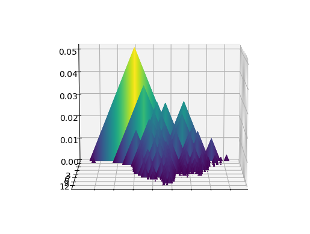
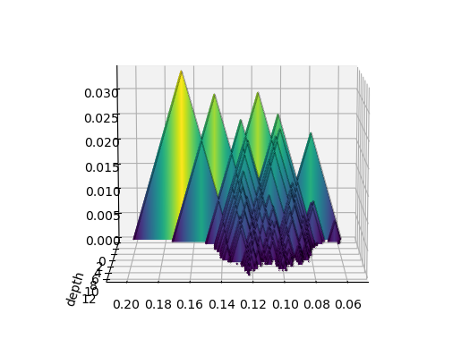
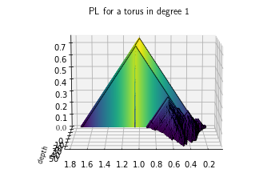

## pyscapes: Persistence landscapes in python

This packages implements persistence landscapes in a user-friendly
fashion in python. Persistence landscapes are a vectorization scheme for
persistent homology, providing a robust set of feature maps. 

Persistence Landscapes were introduced in 
[Bubenik](https://jmlr.org/papers/volume16/bubenik15a/bubenik15a.pdf).
These provide a functional representation of persistence diagrams amenable
to statistical analysis. They have been proven to be very useful in a variety
of empirical and theoretical applications. See the examples provided 
in [Bubenik](https://arxiv.org/abs/1810.04963).

Our implementation follows the algorithms provided in 
[Bubenik, Dlotko](https://www.sciencedirect.com/science/article/abs/pii/S0747717116300104).
Dlotko has also implemented many of these algorithms in C++ directly in the
Persistence Landscape Toolbox, available 
[here](https://www.math.upenn.edu/~dlotko/persistenceLandscape.html).


### Why persistence landscapes?
- They were one of the first vectorization schemes introduced for persistent
homology, yet we aren't aware of any implementations in python TDA libraries, 
e.g., scikit-tda.
- They are (essentially) non-parametric feature maps. Hence they do not
require any hyperparameter tuning.
- They have already been shown to be quite successful in a variety of 
applications.

### Goals of this implementation
- To interface cleanly with existing libraries for computing persistent
homology (e.g., [ripser.py](https://github.com/scikit-tda/ripser.py)).
- To interface cleanly with existing libraries for machine learning
(e.g., [scikit-learn](https://scikit-learn.org/stable/index.html)).


### Example
While the code is not yet ready for public consumption, here we give a 
brief overview of how it can be used.

#### Exact vs Grid
We provide two different implementations of Persistence Landscapes:

- `PersistenceLandscapeExact` provides an exact implementation. All methods 
and computations done in this class are as accurate as the floating point
arithmetic of Python. In particular, there are __no approximations__ in
our calculations. Landscape functions are internally stored as a list
of their critical points. Instantiation is fast but arithmetic operations,
such as summing and averaging can be quite slow because of this. 

- `PersistenceLandscapeGrid` provides an approximate implementation. 
The landscape functions are sampled on an equally spaced grid, defined by
`start`, `stop`, and `num_steps`.
This approximation allows us to easily embed the landscape in a `num_steps`-dimensional
real vector space. Instantiating these can be slower than their exact counterparts due
to this sampling. However, arithmetic operations tend to be much faster because
of this approximation, especially because of Numpy's vectorized operations.

The API is designed to be as consistent as possible between the two
instantiations. Arithmetic operations and norms are defined for both.
Each has a `compute` flag 

Examples of both are provided below.

#### Sample code, exact

```python
import numpy as np
from ripser import ripser
from PersistenceLandscapeExact import PersistenceLandscapeExact  # to be updated

data = np.random.random_sample((200,2)) # generate random points
diagrams = ripser(data)['dgms'] # compute persistent homology
M = PersistenceLandscapeGrid(dgms=diagrams, hom_deg=1) # instantiate
M.compute_landscape() # compute the landscape
```
Computing the actual functions that comprise a persistence landscape can 
be computationally intensive, so we
don't compute them upon instantiation by default. Instead they're only computed 
after the `compute_landscape` method is called, serving as an initialization 
method. 

Basic arithmetic operations are implemented. This allows for
arbitrary linear combinations of persistence landscapes, including
averages. Norms are implemented for quantifying differences and to
ease the use of permutation tests.
```python
L = 2*M
J = M + M
K = M/5
L.p_norm(p=2) # 0.02026
L.infinity_norm() # 0.063817
```
Persistence Landscapes can also be plotted with `plot_landscape`.
Here are some examples.

<p float="left">


</p>

#### Sample code, grid
```python
from tadasets import torus
from PersistenceLandscapeGrid import PersistenceLandscapeGrid  # to be updated

torus_pts = torus(n=1000) # 1000 points on a torus
torus_dgms = ripser(torus_pts)['dgms'] # compute PH
tor_pl = PersistenceLandscapeGrid(dgms=torus_dgms, hom_deg=1, compute=True) # compute and instantiate

plot_landscape(landscape=tor_pl, title=r"PL for a torus in degree 1")
```


See the documentation and examples for more details.
